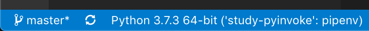
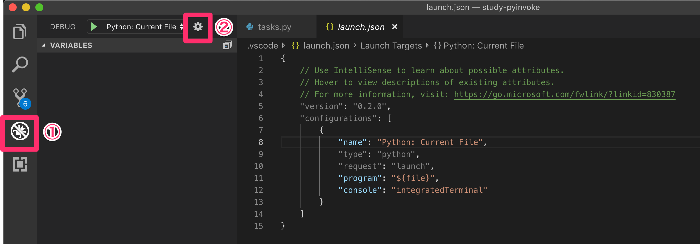
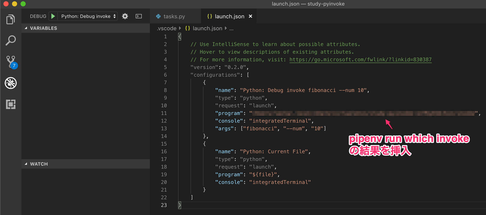

# VSCode + Pipenv で Python Invoke をデバッグする

## TL;DR
`pipenv run which invoke` の結果を `launch.json` の `program` に指定

## 概要
サクッと CLI ツールを作るときには [Python][python] + [Invoke][invoke] が便利です。
Invoke に関する解説はたくさんあるので、この記事では省略します。
本記事では、 VSCode で Invoke を用いた開発をする際にデバッグする方法を解説します。

## 環境
* [Python 3.7.3][python]
* [Pipenv 2018.11.26_2][pipenv]
* [Invoke 1.2.0][invoke]
* [Visual Studio Code 1.36.1][vscode]

コードは [Github][github] に置きました。

[python]: https://www.python.org/
[pipenv]: https://docs.pipenv.org/en/latest/
[invoke]: http://www.pyinvoke.org/
[vscode]: https://azure.microsoft.com/ja-jp/products/visual-studio-code/
[github]: https://github.com/lasta/study-pyinvoke

## デバッグ対象のコード
今回はデバッグ対象として、フィボナッチ数の計算プログラムを用意しました。
`num` で受け取った数番目のフィボナッチ数を返却します。

```python:tasks.py
#!/usr/bin/env python

from invoke import task


@task
def fibonacci(c, num):
    n = int(num)
    if n < 0:
        print("[Error]: num must be natural number or 0.")
        exit(1)

    print(calculate_fibonacci(n))

def calculate_fibonacci(num: int) -> int:
    if num < 0:
        raise ValueError("num must not be negative.")
    
    if num == 0:
        return 0
    
    if num == 1:
        return 1

    n_2 = 0 # fib[n-2]
    n_1 = 1 # fib[n-1]
    n = 1 # fib[n]

    for _ in range(1, num):
        n = n_2 + n_1
        n_2 = n_1
        n_1 = n
    
    return n

```

また、下記のコマンドで仮想環境を作成し、 invoke をインストールしました。

```console
$ cd path/to/project
$ pipenv --python 3.7
$ pip install invoke
```

## VSCode の設定

### 仮想環境
`Pipfile` が存在するディレクトリで `code .` を実行することで、 VSCode は自動的に仮想環境を認識します。



### デバッグ
Debug -> Configure or Fix `launch.json` でデバッグ環境の設定を開きます。



`launch.json` の `.configurations[]` にデバッグの設定を追加します。
今回は `invoke fibonacci --num 10` をデバッグ実行するような設定にします。

`invoke` を用いたプログラムは `tasks.py` を `python` コマンドで直接起動せず、 `invoke` コマンドを用います。
そのため、デバッガに指定するプログラムファイルは `tasks.py` ではなく `invoke` 自身になります。

`invoke` コマンド自身は Python プログラムになります。
`invoke` 自身は仮想環境にて管理されているため、下記のコマンドで探します。

```console
$ pipenv run which invoke
```

この結果を `launch.json` の `program` に指定することで、デバッグ実行可能になります。

```json
{
    "name": "Python: Debug invoke fibonacci --num 10",
    "type": "python",
    "request": "launch",
    "program": "path/to/invoke", // `pipenv run which invoke` の結果を挿入
    "console": "integratedTerminal",
    "args": ["fibonacci", "--num", "10"]
}
```



これで Invoke を用いたプログラムも VSCode でデバッグ実行できるようになりました。

## まとめ
今回は Invoke を用いたプログラムを VSCode でデバッグする方法を紹介しました。
Invoke に
